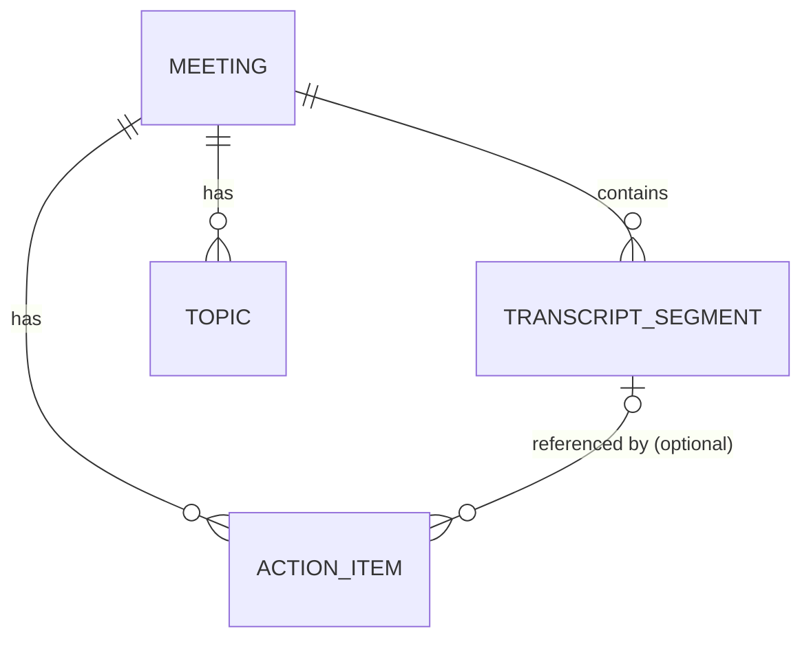

# Meeting Notes Platform (Fireflies.ai Clone)

A transcript-first meeting intelligence platform built as a 24-hour take-home assignment. Users create meetings by pasting or uploading a transcript, and the backend generates a summary, topics, and action items from that transcript — no audio recording or external AI API required.

## Project Overview

The product mirrors the core loop of Fireflies.ai: a dashboard of past meetings, a detail view with transcript + AI-style notes, and a way to create new meetings from transcript text. Since building real-time audio transcription in 24 hours is unrealistic, the assignment is scoped around **transcripts as the source of truth** — audio upload is treated as an optional, unimplemented enhancement rather than the core workflow.

## Features

- **Meeting dashboard** — list of meetings sorted by recency, with search across titles and transcript content.
- **Meeting creation** — paste a transcript directly or upload a `.txt`/`.json` transcript file, along with a title and participant list.
- **Automatic notes generation** — summary, topics, and action items are derived from the transcript using deterministic, rule-based logic (no external LLM calls, no API keys required).
- **Meeting detail view** — transcript (searchable, clickable lines), summary, topic tags, and an action item checklist.
- **Action item tracking** — mark action items complete/incomplete.
- **Seeded demo data** — five realistic meetings with full transcripts load automatically on first run, so the app is populated immediately.

## Tech Stack

**Frontend:** Next.js (App Router), TypeScript, TailwindCSS
**Backend:** FastAPI, SQLAlchemy (sync), SQLite, Pydantic

No ORM abstraction layers, no state management library, no CSS-in-JS, no design-system tooling (e.g. class-variance-authority) — kept intentionally minimal for the assignment's time box.

## Folder Structure

```
backend/
├── main.py                  # FastAPI app, CORS, router include, startup (create tables + seed)
├── database.py               # engine, SessionLocal, Base, get_db
├── seed.py                   # seeds 5 demo meetings with full transcripts
├── requirements.txt
├── models/                   # SQLAlchemy ORM models, one file per entity
│   ├── meeting.py
│   ├── transcript.py
│   ├── action_item.py
│   └── topic.py
├── schemas/                  # Pydantic request/response models, one file per entity
│   ├── meeting.py
│   ├── transcript.py
│   ├── action_item.py
│   └── topic.py
├── routers/
│   └── meetings.py           # all meeting HTTP routes
└── services/
    └── meeting_service.py    # transcript parsing + mock summary/topic/action-item generation

frontend/
├── app/
│   ├── layout.tsx             # root layout, global styles, responsive container
│   ├── page.tsx                # dashboard: search, sort, meeting list
│   ├── upload/page.tsx         # create-meeting form
│   └── meetings/[id]/page.tsx  # meeting detail: transcript + summary + action items
├── components/
│   ├── MeetingCard.tsx
│   ├── TranscriptView.tsx
│   ├── SummaryPanel.tsx
│   ├── UploadForm.tsx
│   └── ui/                     # lightweight primitives: Button, Card, Input, Textarea, Modal
└── lib/
    ├── types.ts                 # TypeScript interfaces mirroring backend schemas
    └── api.ts                   # fetch wrapper + one function per backend endpoint
```

## Architecture Overview

Both sides use a flat, conventional layering with no enterprise patterns (no Repository pattern, no DDD, no CQRS, no dependency-injection framework):

- **Backend:** `routers` handle HTTP concerns (parsing requests, status codes, 404s) and delegate all business logic — transcript parsing, summary/topic/action-item generation, persistence — to `services/meeting_service.py`. SQLAlchemy models are used directly in routers/services; there's no repository layer between them.
- **Frontend:** App Router pages fetch data (server components where possible, client components where interactivity is needed) and compose small, single-purpose components. `lib/api.ts` is the only place that talks to the backend — components never call `fetch` directly.

This keeps the codebase easy to navigate end-to-end in an interview walkthrough: HTTP route → service function → ORM model, and page → component → `lib/api.ts` call.

## Database Schema

Four tables, all hanging off `Meeting` as the root entity:

| Table | Key Fields | Relationship |
|---|---|---|
| `meetings` | title, participants, created_at, summary, audio_url | — |
| `transcript_segments` | meeting_id (FK), order_index, speaker, start_time, text | Meeting 1—* Segment |
| `action_items` | meeting_id (FK), segment_id (FK, nullable), text, owner, is_done | Meeting 1—* ActionItem |
| `topics` | meeting_id (FK), label | Meeting 1—* Topic |



No `User`, `Speaker`, or `Summary` tables — speakers are plain text labels on segments, and a meeting's summary is a single `Text` column rather than a versioned/normalized entity. Transcript search runs as a `LIKE` query over `transcript_segments.text`, which is sufficient at this dataset size; SQLite FTS5 would be the natural upgrade if search became a real bottleneck.

## API Endpoints

| Method | Path | Purpose |
|---|---|---|
| GET | `/meetings` | List meetings, optional `search` query param, sorted by recency |
| GET | `/meetings/{id}` | Full meeting detail (transcript, summary, topics, action items) |
| POST | `/meetings` | Create a meeting from pasted text or an uploaded `.txt`/`.json` file (`multipart/form-data`) |
| PUT | `/meetings/{id}` | Update meeting title/participants |
| DELETE | `/meetings/{id}` | Delete a meeting (cascades to segments, action items, topics) |
| PATCH | `/action-items/{id}` | Update an action item, primarily toggling `is_done` — **designed, not yet implemented** |
| GET | `/meetings/{id}/transcript` | Transcript segments only, lighter payload for the transcript pane — **designed, not yet implemented** |

Full request/response contracts are documented in the API specification produced during design (not checked into this repo as a separate file).

## Setup Instructions

**Prerequisites:** Node.js 18+, Python 3.11+

```bash
git clone <repo-url>
cd scalarAI
```

## Running Backend

```bash
cd backend
python -m venv venv
venv\Scripts\activate        # Windows
pip install -r requirements.txt
uvicorn main:app --reload
```

The API runs at `http://localhost:8000`. On startup, tables are created automatically and the database is seeded with 5 demo meetings if it's empty — no manual migration or seed step required.

## Running Frontend

```bash
cd frontend
npm install
```

Create `frontend/.env.local`:
```
NEXT_PUBLIC_API_URL=http://localhost:8000
```

```bash
npm run dev
```

The app runs at `http://localhost:3000`. Start the backend first so the dashboard has data to load.

## Deployment

Not deployed for this assignment — designed to be run locally for demo/review. If this went to production:

- **Frontend** would deploy to Vercel with `NEXT_PUBLIC_API_URL` pointed at the hosted API.
- **Backend** would deploy to a small Render/Railway instance. SQLite's single-file nature works for a local demo but doesn't survive ephemeral/serverless filesystems or multiple instances — swapping `database.py`'s connection string to Postgres would be a drop-in change since no raw SQL or SQLite-specific features are used elsewhere.

## Trade-offs

Deliberate simplifications made to fit a 24-hour scope:

- **Mocked AI, not a real LLM call.** `generate_summary`, `extract_topics`, and `extract_action_items` use deterministic, rule-based logic (keyword frequency, phrase matching) instead of calling OpenAI/Anthropic. This keeps the app runnable offline, free, and demo-reliable, at the cost of lower-quality output than a real model would produce.
- **SQLite over Postgres.** Zero setup, file-based, ships with Python — the right call for a take-home, not for concurrent production traffic.
- **No auth.** Single-tenant, no login — out of scope for what's being evaluated here.
- **`LIKE`-based search**, not full-text search — fine at seed-data scale (5 meetings), would need FTS5 or a real search index at real scale.
- **Action items are nested under meetings**, not a fully independent REST resource, since they're never accessed outside the context of a meeting in this UI.
- **A few designed pieces are not yet implemented:** the `PATCH /action-items/{id}` and `GET /meetings/{id}/transcript` endpoints are specified in the API design but not wired into `routers/meetings.py`; a handful of small frontend components referenced by pages (`Navbar`, `SearchBar`, `SortDropdown`, `MeetingList`, `EmptyState`, `LoadingState`, `AudioPlayerPlaceholder`) and the Next.js project scaffolding (`package.json`, `tailwind.config.ts`, `globals.css`) are designed but pending — this repo reflects an in-progress, incrementally-reviewed build rather than a finished submission.

## Future Improvements

- Real transcription via Whisper/AssemblyAI for the optional audio-upload path.
- Real LLM-based summarization and action-item extraction, with the current rule-based functions kept as a free fallback.
- SQLite FTS5 (or Postgres full-text search) for transcript search at scale.
- Pagination on `GET /meetings` once meeting counts grow past a single page.
- Basic auth/multi-tenancy if this became a real multi-user product.
- Automated tests (backend: pytest against the service functions; frontend: component tests for the transcript/action-item interactions).
- Speaker diarization improvements — real audio would need actual voice separation instead of relying on `"Speaker: text"` line prefixes.
